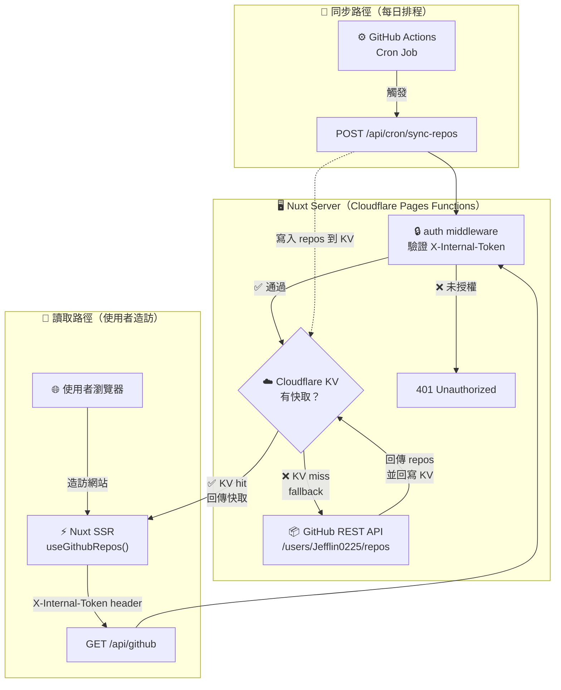

# JeffLin.dev

> 個人作品集網站 — [jefflin-dev.pages.dev](https://jefflin-dev.pages.dev)

**Tech Stack**: Nuxt 4 · Tailwind CSS · Cloudflare Pages · Cloudflare KV · Fuse.js

---

## 專案架構

```
JeffLin.dev/
├── app/
│   ├── composables/        # useGithubRepos（資料 + 搜尋邏輯）
│   ├── components/         # UI 元件
│   └── pages/              # 頁面
├── server/
│   ├── middleware/
│   │   └── auth.ts         # API 存取保護（X-Internal-Token 驗證）
│   ├── api/
│   │   ├── github/         # GET /api/github — 讀取 repos
│   │   └── cron/           # POST /api/cron/sync-repos — 觸發同步
│   └── utils/
│       ├── github.ts       # GitHub REST API 封裝
│       └── useKV.ts        # Cloudflare KV binding 封裝
└── nuxt.config.ts
```

**資料流**：



---

## 快速開始

```bash
npm install
npm run dev
```

啟動後 `nitro-cloudflare-dev` 會自動模擬 Cloudflare KV binding，資料存在 `.wrangler/state/`。

> **本地開發不需要設定 token**，`INTERNAL_API_TOKEN` 未設定時 auth middleware 會自動跳過驗證。

---

## API 安全機制

所有 `/api/*` 路由受 `server/middleware/auth.ts` 保護，需要在 header 帶上內部 token：

```
X-Internal-Token: <INTERNAL_API_TOKEN>
```

前端 (`useGithubRepos`) 會自動注入，外部無法直接呼叫後端 API。

**本地開發測試（需手動帶 header）**：

```bash
# 手動同步 GitHub repos 到 KV
curl -X POST http://localhost:3000/api/cron/sync-repos \
  -H "X-Internal-Token: <你的 token>"

# 讀取 repos
curl http://localhost:3000/api/github \
  -H "X-Internal-Token: <你的 token>"
```

預期回傳：

```json
// POST /api/cron/sync-repos
{ "success": true, "message": "Synced 25 repos", "lastSync": "...", "kvAvailable": true }

// GET /api/github
{ "success": true, "data": [ ... ], "lastSync": "..." }
```

- `kvAvailable: true` — KV binding 可用（本地模擬成功）
- `lastSync` 有值 → 資料來自 KV；無值 → fallback 直接打 GitHub API

---

## Cloudflare 環境設定

### Environment Variables

| 變數名稱 | 說明 |
|---|---|
| `NUXT_GITHUB_TOKEN` | GitHub PAT（`read:public_repo` 權限） |
| `NUXT_INTERNAL_API_TOKEN` | 後端 API 驗證 token |
| `NUXT_PUBLIC_INTERNAL_API_TOKEN` | 前端帶出的 API token（與上方相同值） |

產生 token：

```bash
openssl rand -hex 32
```

### KV Namespace Binding

在 Cloudflare Pages → Settings → Functions → KV namespace bindings：

- **Binding name**: `KV`
- **Namespace**: 對應你建立的 KV namespace

### 查看遠端 KV 內容

```bash
# 列出所有 key
npx wrangler kv key list --namespace-id <KV_NAMESPACE_ID> --remote

# 讀取特定 key
npx wrangler kv key get "github:repos:all" --namespace-id <KV_NAMESPACE_ID> --remote
npx wrangler kv key get "github:repos:lastSync" --namespace-id <KV_NAMESPACE_ID> --remote
```

---

## Build & Deploy

> ⚠️ 本專案使用 **Cloudflare Pages Functions** 執行 `/api/*`（需要 KV + GitHub Token）
> 必須用 `npm run build`，**不能用 generate**（generate 只輸出靜態 HTML，API 無法運作）

```bash
# Build（產出 Cloudflare Pages Functions 格式到 dist/）
npm run build

# 本地用 wrangler 模擬 Cloudflare 環境預覽（需先 build）
npm run cf:preview

# 部署到 Cloudflare Pages（需先 build）
npm run cf:deploy
```

## Scripts 速查

| Script | 用途 | 備註 |
|--------|------|------|
| `npm run dev` | 本地開發（KV 自動模擬） | — |
| `npm run build` | 產出 CF Pages Functions 到 `dist/` | **部署前必跑** |
| `npm run cf:preview` | wrangler 本地預覽 | 需先 build |
| `npm run cf:deploy` | 部署到 Cloudflare Pages | 需先 build |

