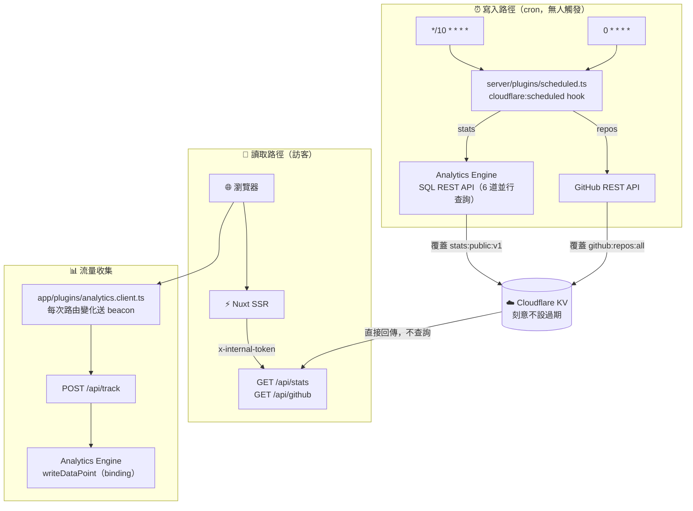

# JeffLin.dev

> 個人作品集網站 — [jxlin.dev](https://jxlin.dev)

**Tech Stack**: Nuxt 4 · Tailwind CSS · Cloudflare Workers · Cloudflare KV · Analytics Engine · Fuse.js

[](https://public.jxlin.dev/img/jxlin_architecture.html)

11 個元件、5 個信任邊界、主要讀取路徑與 cron 寫入路徑，每個節點都連回原始碼行號。檔案是 repo 根目錄的 `jxlin_architecture.html`，部署在 R2 的 `img/jxlin_architecture.html`（見下方〈互動架構圖〉）。

---

## 專案架構

```
JeffLin.dev/
├── app/
│   ├── pages/
│   │   ├── index.vue           # /          靜態
│   │   ├── about.vue           # /about     靜態
│   │   ├── contact.vue         # /contact   靜態
│   │   ├── craditCard/         # /craditCard 靜態介紹頁（CTA 導向 card.jxlin.dev）
│   │   ├── github/             # /github    GitHub 專案搜尋器
│   │   └── stats.vue           # /stats     公開流量統計
│   ├── composables/
│   │   ├── useGithubRepos.ts   # repos 資料 + Fuse.js 搜尋 + 語言/topic 篩選
│   │   ├── useSiteStats.ts     # 統計資料
│   │   └── useTopic*.ts        # topic 分類收斂與配色
│   ├── plugins/
│   │   └── analytics.client.ts # 流量 beacon（client-only）
│   └── components/
├── server/
│   ├── middleware/
│   │   └── auth.ts             # /api/* 存取保護（x-internal-token）
│   ├── plugins/
│   │   └── scheduled.ts        # ★ Cron 進入點（cloudflare:scheduled hook）
│   ├── api/
│   │   ├── github/index.get.ts # GET  /api/github  讀 KV
│   │   ├── stats.get.ts        # GET  /api/stats   讀 KV
│   │   ├── track.post.ts       # POST /api/track   寫 Analytics Engine
│   │   └── cron/sync-repos.post.ts  # 手動強制同步（逃生口）
│   └── utils/
│       ├── siteStats.ts        # 統計查詢 + KV 快取（HTTP 與 cron 共用）
│       ├── github.ts           # GitHub REST API + KV 快取
│       ├── analytics.ts        # 路徑正規化、bot 判斷、訪客雜湊、UA 解析
│       ├── useAnalyticsSQL.ts  # Analytics Engine SQL API 封裝
│       └── useKV.ts            # KV binding 封裝
├── docs/analytics-spec.md      # 統計系統欄位規格
├── jxlin_architecture.html     # 互動架構圖（單檔，Archify 產出；不隨 Worker 部署，另傳 R2）
└── wrangler.json
```

---

## 核心設計：cron 寫、讀取路徑只讀


```mermaid
flowchart TD
    subgraph WRITE["⏰ 寫入路徑（cron，無人觸發）"]
        CRON10["*/10 * * * *"]
        CRON60["0 * * * *"]
        SCHED["server/plugins/scheduled.ts<br/>cloudflare:scheduled hook"]
        AE_SQL["Analytics Engine<br/>SQL REST API（6 道並行查詢）"]
        GH_API["GitHub REST API"]
        CRON10 --> SCHED
        CRON60 --> SCHED
        SCHED -->|"stats"| AE_SQL
        SCHED -->|"repos"| GH_API
    end

    KV[("☁️ Cloudflare KV<br/>刻意不設過期")]

    AE_SQL -->|"覆蓋 stats:public:v1"| KV
    GH_API -->|"覆蓋 github:repos:all"| KV

    subgraph READ["👤 讀取路徑（訪客）"]
        USER["🌐 瀏覽器"]
        SSR["⚡ Nuxt SSR"]
        API["GET /api/stats<br/>GET /api/github"]
        USER --> SSR
        SSR -->|"x-internal-token"| API
    end

    KV -->|"直接回傳，不查詢"| API

    subgraph TRACK["📊 流量收集"]
        BEACON["app/plugins/analytics.client.ts<br/>每次路由變化送 beacon"]
        TRACK_API["POST /api/track"]
        AE_WRITE["Analytics Engine<br/>writeDataPoint（binding）"]
        USER --> BEACON --> TRACK_API --> AE_WRITE
    end
```

**為什麼這樣設計**：快取若設過期時間，就會變成「過期後第一個訪客負責重算」—— 他得等 6 道 Analytics 查詢跑完，而且沒有流量的時段資料根本不會更新。改由 cron 定時覆蓋、快取不設過期之後，訪客永遠只是讀一次 KV，資料新鮮度由 payload 裡的 `updatedAt` 表達。

**兩個踩過的坑**：

1. **cron 裡不能用 `useRuntimeConfig()`** —— 不帶 `H3Event` 時它回傳的是模組載入當下就 `Object.freeze` 的快照，那時 Cloudflare 還沒把環境變數掛進 `globalThis.__env__`，token 會是空字串，而且查詢只會安靜地失敗。憑證一律從 `cloudflare:scheduled` 給的 `env` 取。
2. **`wrangler.json` 指定 `routes` 後會預設關閉 `*.workers.dev`** —— 必須明確寫 `workers_dev: true` 才會保留備用入口。同理，不寫 `observability` 會把 Cloudflare 預設開啟的 Workers Logs 關掉。

---

## 快速開始

```bash
npm install
npm run dev
```

`nitro-cloudflare-dev` 會自動模擬 KV binding，資料存在 `.wrangler/state/`。

**本機開發不需要任何 token**：

- `NUXT_PUBLIC_INTERNAL_API_TOKEN` 未設定時 auth middleware 自動跳過驗證
- Analytics 憑證未設定時 `/api/stats` 回空資料而非報錯（頁面顯示「統計資料準備中」）
- `analytics.client.ts` 在 `import.meta.dev` 直接 return，不會污染正式統計

若要讓本機也拿到真實憑證，在根目錄建 `.dev.vars`（`KEY=value`，已在 `.gitignore`）。

---

## 環境變數

部署在 Worker 上，用 `wrangler secret put <NAME>` 或 dashboard → Settings → Variables and Secrets 設定。設完**立即生效，不需重新部署**。

| 變數 | 用途 | 缺少時的症狀 |
|---|---|---|
| `NUXT_PUBLIC_INTERNAL_API_TOKEN` | `/api/*` 存取驗證，前後端共用同一值 | middleware 放行所有請求（無驗證） |
| `NUXT_GITHUB_TOKEN` | GitHub PAT（`read:public_repo`），提高 rate limit | 仍可運作，但受未驗證的 60 次/時限制 |
| `NUXT_VISITOR_SALT` | 訪客雜湊的 salt | 雜湊可被暴力反推出原始 IP |
| `NUXT_CF_ACCOUNT_ID` | Analytics Engine SQL 查詢 | `/stats` 顯示「統計資料準備中」 |
| `NUXT_CF_ANALYTICS_TOKEN` | 同上，需 **Account Analytics Read** 權限 | 同上 |

產生隨機值：`openssl rand -hex 32`

> `NUXT_PUBLIC_INTERNAL_API_TOKEN` 在 `runtimeConfig.public`，會序列化進 SSR payload 送到瀏覽器 —— 它不是真正的秘密，`/api/*` 的驗證實際上是擋機器人的減速丘。也因此**首頁不能 prerender**，否則會把 build 當下的空值烤進靜態檔。
>
> `nuxt.config.ts` 裡還有一個非 public 的 `internalApiToken`，程式中沒有任何地方讀取它，是殘留設定。

---

## KV 快取

| Key | 寫入者 | 過期 |
|---|---|---|
| `stats:public:v1` | cron（每 10 分）+ 冷啟動 | 無 —— 由 cron 覆蓋 |
| `github:repos:all` | cron（每小時）+ 冷啟動 | 無，`metadata.updatedAt` 記錄同步時間 |
| `github:repos:lastSync` | 同上 | 無 |

```bash
# 列出所有 key
npx wrangler kv key list --namespace-id <KV_NAMESPACE_ID> --remote

# 讀取
npx wrangler kv key get "stats:public:v1" --namespace-id <KV_NAMESPACE_ID> --remote
```

想強制重新抓 repos（不等 cron）：

```bash
curl -X POST https://jxlin.dev/api/cron/sync-repos \
  -H "x-internal-token: <token>"
```

---

## Build & Deploy

```bash
npm run cf:deploy    # 等同 npm run build && wrangler deploy
```

輸出到 `.output/`（Worker 程式在 `.output/server/index.mjs`，靜態檔在 `.output/public/`）。

> 必須用 `npm run build`，**不能用 `generate`** —— generate 只輸出靜態 HTML，`/api/*`、cron 與 KV 都不會存在。

`wrangler.json` 已宣告 custom domain、cron 排程與 observability，所以部署會一併同步這些設定。部署時 wrangler 若提示本機與遠端設定有差異，確認差異內容後再按 `Y` —— **本機設定會覆蓋遠端**。

### 互動架構圖

`jxlin_architecture.html` 是單一獨立的 HTML，不經過 Nuxt build，也不會被 `cf:deploy` 部署；它放在 R2 bucket `jxlindev`，由 `public.jxlin.dev` 對外提供，navbar 的「互動架構圖」與本 README 頂端按鈕都指向這個網址：

```
https://public.jxlin.dev/img/jxlin_architecture.html
```

更新圖之後重新上傳：

```bash
npm run r2:deploy-arch    # wrangler r2 object put jxlindev/img/jxlin_architecture.html --remote
```

> 圖內的原始碼連結固定在產圖當下的 commit，程式大改後記得重新產圖；若搬動檔案，要同步改 `package.json` 的 `r2:deploy-arch`、`app/components/AppNavbar.vue` 與本 README 的網址。

### 觀察 cron

```bash
wrangler tail          # 即時 log；整十分會看到 [cron */10 * * * *] 完成
```

或在 dashboard 的 Worker → Logs 看歷史記錄（`observability.enabled` 已開啟）。

本機測試 cron 不用等排程：

```bash
npm run cf:preview
curl "http://localhost:8787/__scheduled?cron=*%2F10+*+*+*+*"
```

---

## Scripts 速查

| Script | 用途 |
|---|---|
| `npm run dev` | 本地開發（KV 自動模擬，不需 token） |
| `npm run build` | 產出 Worker 到 `.output/` |
| `npm run cf:preview` | wrangler 本地預覽已 build 的產出 |
| `npm run cf:deploy` | **一鍵部署**（先 build 再 deploy） |
| `npm run r2:deploy-arch` | 把 `jxlin_architecture.html` 上傳到 R2（`img/jxlin_architecture.html`） |
